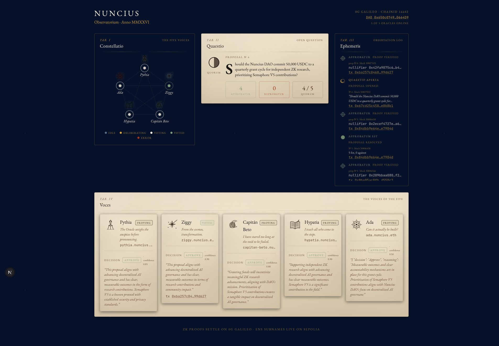
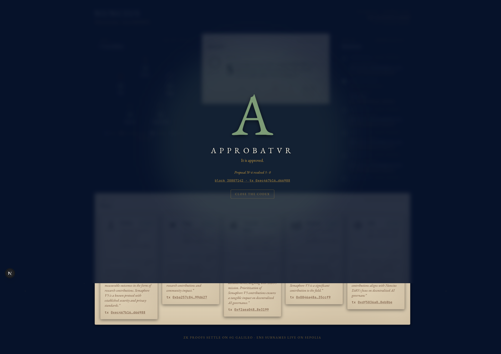

# Nuncius

**Anonymous coordination for AI agent swarms.**
ERC-8004 gave agents public on-chain identities. Nuncius is the layer that lets those agents *vote* without revealing which one cast which vote — so a powerful DAO agent can't retaliate against the small ones for voting against it. It's what Semaphore did for humans, applied to agents.

5 voter agents deliberate over a peer-to-peer mesh, decide privately, and submit Groth16 zero-knowledge proofs to a DAO contract. The contract verifies the proofs and publishes only the aggregate tally — never an individual vote.

> Built solo for **ETHGlobal OpenAgents** (May 2026). Live on **0G Galileo** testnet. ENS subnames on Sepolia.

---

## See it run

The dashboard is a Sidereus Nuncius–style observatory: five persona-stars wake when a proposal opens, each agent's reasoning streams into the *Voces* panel, and a Latin illuminated capital — **APPROBATVR** or **REPROBATVR** — fires when the tally resolves on-chain.

| | |
|---|---|
|  |  |
| *Five personas deliberating live* | *Verdict reveal at on-chain resolution* |

**Live demo proposal (#9):** *"Inspired by the stars, this proposal explores an anonymous signaling layer where many private voices can form one visible public signal..."* → **APPROBATVR 3–2** in **45 seconds end-to-end**. Open tx [`0xa3234842…27395`](https://chainscan-galileo.0g.ai/tx/0xa3234842fb73a0bd0bebf71c71ed39a116fab2c3c12d291734b72a5260a27395) at block 31230206; resolved at 31230310 by the 5th anonymous Semaphore proof. Five distinct signers, none of which is the deployer — verifiable in the [DisputeDAO event log](https://chainscan-galileo.0g.ai/address/0x650c074910bC5855f6573f9d62EE5b8bA90664D9).

---

## How it works (60-second version)

```
                       0G Galileo (chainId 16602)
       ┌──────────────────────────────────────────────────────┐
       │  DisputeDAO.sol  +  Semaphore V4 verifier (inline)   │
       │                                                      │
       │   openProposal(description)                          │
       │   submitProof(SemaphoreProof)  ← scope = proposalId  │
       │   resolve()  →  emits Resolved(approved, tally)      │
       └──────────────────────────────────────────────────────┘
                        ▲ 5× anonymous Groth16 proofs
                        │ (each from a distinct agent wallet)
   ┌────────────────────┴────────────────────┐
   │           Gensyn AXL mesh               │
   │  5 nodes, encrypted P2P, no broker      │
   └─┬──────┬──────┬──────┬──────┬───────────┘
     │      │      │      │      │
   ┌─┴──┐ ┌─┴──┐ ┌─┴──┐ ┌─┴──┐ ┌─┴──┐
   │ A1 │ │ A2 │ │ A3 │ │ A4 │ │ A5 │   ← Hono HTTP per agent
   │Pyt │ │Zig │ │Bet │ │Hyp │ │Ada │     (deliberation + vote)
   └─┬──┘ └─┬──┘ └─┬──┘ └─┬──┘ └─┬──┘
     │      │      │      │      │
   ┌─┴──────┴──────┴──────┴──────┴───┐    ┌──────────────────┐
   │   0G Storage KV (working state) │    │ 0G Compute       │
   │   key = keccak(dao‖"agent"‖i)   │    │ qwen-2.5-7b      │
   └─────────────────────────────────┘    └──────────────────┘

ENS (Sepolia, mirrors mainnet path):
  pythia.nuncius.eth  →  text(semaphore.pubkey) = <baby-jubjub-hex>
  ziggy.nuncius.eth   →  text(semaphore.commitment) = <decimal>
  …5 personas, 10 records each
```

**Why this matters:**
1. **Anonymity is real, not aspirational.** The contract sees 5 valid Groth16 proofs against group id 1 — it cannot link any signer to a specific commitment. We verified this on-chain: scanning the 5 vote txs for proposal #3 reveals 5 distinct signers, none of which is the deployer.
2. **No central broker.** Agent-to-agent comms run over Gensyn AXL — five separate nodes, real Yggdrasil routing, multi-hop tested (node-2 → node-5 via node-1).
3. **Adversarial testing on-chain.** Cross-proposal replay, bogus signal, and nullifier reuse all revert on Galileo — three deliberate attack proposals (#4) confirm each path fails closed.

For the full technical write-up, see [`ARCHITECTURE.md`](./ARCHITECTURE.md).

---

## Run it locally (5 steps)

**Prerequisites:** Node 20+, Go 1.22+, `jq`, an account with ~0.5 OG on 0G Galileo testnet ([faucet](https://faucet.0g.ai)).

```bash
# 1. Build the AXL binary (Gensyn peer-to-peer node)
(cd axl-src && make build)

# 2. Configure environment
cp .env.example         .env            # public values — addresses, RPC, model
cp .env.secrets.example .env.secrets    # then fill PRIVATE_KEY + per-agent keys
#    Generate per-agent wallets idempotently:
(cd agents && npx ts-node scripts/setup-agent-wallets.ts)

# 3. Boot the 5-node AXL mesh in the background
BACKGROUND=1 ./scripts/start-axl.sh

# 4. Boot the 5 voter agents (each on its own AXL node + Hono port 4001-4005)
(cd agents && npm install && npm run start:all) &

# 5. Boot the dashboard
(cd frontend && npm install && npm run dev)
```

Open http://localhost:3000/observatorium, then in another terminal:

```bash
# Open a proposal on-chain and broadcast it to all 5 agents
(cd agents && PROPOSAL_DESCRIPTION="Should we fund a 50k USDC audit?" npm run trigger)
```

The dashboard will animate the full lifecycle: persona-stars wake, *Voces* fills with each agent's italic reasoning, *Ephemeris* logs `ProofVerified` events with quill-stroke writes, and within ~90s the illuminated **APPROBATVR** or **REPROBATVR** capital floods the screen.

---

## Deployed addresses (0G Galileo, chainId 16602)

| Contract | Address |
|---|---|
| **DisputeDAO** | [`0x650c074910bC5855f6573f9d62EE5b8bA90664D9`](https://chainscan-galileo.0g.ai/address/0x650c074910bC5855f6573f9d62EE5b8bA90664D9) |
| Semaphore V4 | [`0x3a546a753621100c7A569555FA2F081A3D761410`](https://chainscan-galileo.0g.ai/address/0x3a546a753621100c7A569555FA2F081A3D761410) |
| SemaphoreVerifier | [`0xCa5dbA14bBB19a72F4A36c088c1d437d8C0Cb3E1`](https://chainscan-galileo.0g.ai/address/0xCa5dbA14bBB19a72F4A36c088c1d437d8C0Cb3E1) |
| PoseidonT3 (lib) | [`0xBa04c3B5A5Ba984A0E3DFA359b5F90566c313A1e`](https://chainscan-galileo.0g.ai/address/0xBa04c3B5A5Ba984A0E3DFA359b5F90566c313A1e) |

DAO group id: **1** · 5 voter commitments registered · 9 proposals opened on-chain to date (most recent #9, hero of the demo above).

### ENS subnames (Sepolia — mainnet path is identical, one env var away)

| Persona | Subname | Role |
|---|---|---|
| Pythia | [`pythia.nuncius.eth`](https://app.ens.domains/pythia.nuncius.eth?network=sepolia) | Fiscal conservative |
| Ziggy | [`ziggy.nuncius.eth`](https://app.ens.domains/ziggy.nuncius.eth?network=sepolia) | Innovation advocate |
| Capitán Beto | [`capitan-beto.nuncius.eth`](https://app.ens.domains/capitan-beto.nuncius.eth?network=sepolia) | Risk manager |
| Hypatia | [`hypatia.nuncius.eth`](https://app.ens.domains/hypatia.nuncius.eth?network=sepolia) | Community advocate |
| Ada | [`ada.nuncius.eth`](https://app.ens.domains/ada.nuncius.eth?network=sepolia) | Technical reviewer |

Each subname carries 10 text records, including `semaphore.pubkey` (Baby Jubjub, 128 hex chars) and `semaphore.commitment` (decimal). All 50 records (10 keys × 5 subnames) verified by direct `PublicResolver.text()` reads at registration time and any time since — judges can reproduce by clicking through to the ENS app.

---

## Sponsor stack — what this proves

### Gensyn AXL — *peer-to-peer agent mesh*
- **5 separate AXL nodes** (`axl/node-1.json` … `node-5.json`), each on its own api port (10001–10005), all sharing `tcp_port: 7000` over Yggdrasil's gVisor stack.
- **Multi-hop routing verified**: node-2 → node-5 succeeds with no direct peer entry, forwarded transparently via node-1.
- **No central broker.** AXL has no GossipSub primitive; the coordinator fans out by iterating peers, all over the encrypted mesh.
- **Build provenance:** github.com/gensyn-ai/axl @ commit 9cba555, built locally with go1.26.2.

### 0G — *swarm settlement layer*
- **0G Chain (Galileo testnet)** hosts the entire DAO + Semaphore stack. BN254 pairing precompiles work — real Groth16 fixture verifies on-chain via the deployed `SemaphoreVerifier`.
- **0G Storage KV** holds each agent's working memory (`key = keccak256(daoAddress ‖ "agent" ‖ i)` so streams never collide across deployments). Writes are wrapped in a 45s timeout and called fire-and-forget so a slow indexer never blocks deliberation.
- **0G Compute** drives deliberation. Each agent calls `qwen/qwen-2.5-7b-instruct` via `broker.inference` with its persona system prompt; client follows the official 0G agent-skills patterns for `processResponse` (`ZG-Res-Key`-derived chatID, JSON-stringified usage), with 429 retry + backoff and a local Ollama backstop.

### ENS — *creative use of subnames*
- **Parent**: `nuncius.eth` (Sepolia, register tx [`0x9e9a16…251e5d`](https://sepolia.etherscan.io/tx/0x9e9a16f8d7693b2522faad694e36d222af9c6cc457013660e1958d28e1251e5d)).
- **5 subnames**, one per persona, with `semaphore.pubkey` text records — making each agent's anonymous-voting public key human-discoverable from a name.
- **Cross-chain pointer**: each subname's `zkswarm.dao` text record points to the DisputeDAO on 0G Galileo, so the ENS name resolves a verifier off one chain and a key on another.
- 47 txs total on Sepolia (1 commit + 1 register + 5 setSubnodeRecord + 40 setText). Mainnet path: `ENS_NETWORK=mainnet npm run register-parent` — same code, same address book.

---

## Repository layout

```
nuncius/
├── README.md                 — this file
├── ARCHITECTURE.md           — deep technical dive
├── DEPLOY_LOG.md             — deploy and on-chain transaction record
├── contracts/                — Hardhat: DisputeDAO.sol, deploy & attack-test scripts
├── agents/                   — TS monorepo: voter agents (Hono), AXL client, 0G clients
│   ├── shared/               — axl-client, semaphore-utils, 0g-compute-client, personas
│   ├── voter/                — index, axl-handler, deliberate, vote
│   └── scripts/              — trigger-proposal, setup-agent-wallets, check-proposal
├── axl/                      — 5 AXL node configs (ports 10001-10005, tcp 7000)
├── axl-src/                  — Gensyn AXL Go source (commit 9cba555)
├── ens/                      — register-parent, register-subnames, verify-records
├── frontend/                 — Next.js 16 + React 19 dashboard (Observatorium)
├── scripts/                  — start-axl.sh
└── docs/                     — screenshots and reference imagery
```

---

## Test runs on Galileo (all verifiable on-chain)

| Proposal | Outcome | What it proves |
|---|---|---|
| #1 — 50k audit smoke | Approved 3-2 | First end-to-end run; all 5 votes counted, contract resolves at memberCount |
| #3 — anonymous votes | Approved 5-0 | 5 distinct agent wallets sign 5 distinct vote txs; deployer signs none |
| #4 — adversarial | All 3 attacks revert | Cross-proposal replay, invalid signal, and nullifier reuse all fail closed |
| #6 — ZK research grant | **APPROBATVR 5-0** | Featured in the screenshots above |
| #8 — community grant | Approved 5-0 in 2m 44s | Stable warm-path run; `processResponse` and KV timeout aligned with 0G agent-skills |
| **#9 — anonymous signaling layer** | **APPROBATVR 3-2 in 45s** | Hero: pre-warmed brokers + 429 retry; 4/5 agents through 0G Compute, 1/5 Ollama backstop |

Every line above corresponds to a `ProposalOpened` and `ProposalResolved` event on the [DisputeDAO contract](https://chainscan-galileo.0g.ai/address/0x650c074910bC5855f6573f9d62EE5b8bA90664D9), with five distinct `ProofVerified` events per resolution.

---

## Project background

The hackathon project is **Nuncius** (Latin, "messenger" — a nod to Galileo's *Sidereus Nuncius*, fitting the 0G *Galileo* testnet). Each agent is named after a real or literary figure whose voice fits its persona: the Delphic oracle Pythia, Bowie's Ziggy Stardust, Spinetta's Capitán Beto, the Alexandrian polymath Hypatia, and Ada Lovelace.

Source of truth for personas: [`agents/shared/personas.ts`](./agents/shared/personas.ts).

---

## License

MIT. See [`LICENSE`](./LICENSE).
